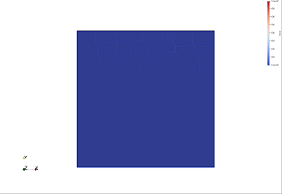
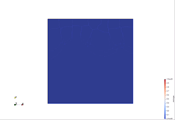
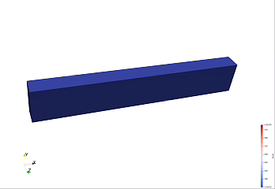
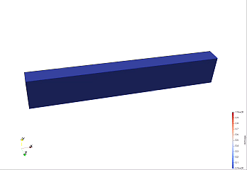
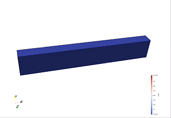
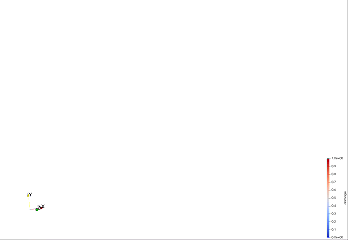

# Thermo-Mechanical Coupled Phase-Field Fracture Model with Explicit Time Integration

[](https://freefem.org/)
[](LICENSE)

This project implements an **explicit thermo-mechanical coupled phase-field fracture model** using [FreeFem++](https://freefem.org/), a high-level multiphysics finite element library. The model solves the coupled system of heat conduction, elastic deformation, and brittle fracture propagation under thermal shock loading conditions.

## References

This implementation is based on the following works:

> [1] **Wang T, Ye X, Liu Z, et al.** A phase-field model of thermo-elastic coupled brittle fracture with explicit time integration[J]. *Computational Mechanics*, 2020, 65(5): 1305-1321.

> [2] **Li D, Li P, Li W, et al.** Three-dimensional phase-field modeling of temperature-dependent thermal shock-induced fracture in ceramic materials[J]. *Engineering Fracture Mechanics*, 2022, 268: 108444.

## Features

- **Thermo-mechanical coupling**: Temperature-dependent thermal strain drives the mechanical response
- **Phase-field fracture**: Diffusive crack representation with a regularization length scale
- **Explicit time integration**: Newmark-β scheme for efficient transient analysis
- **Degradation function**: pf-CZM (phase-field cohesive zone model) approach with controlled softening
- **Tensile/compressive split**: Maximum principal stress-based energy driving force for fracture
- **PETSc parallelization**: Distributed memory parallel computing for large-scale 3D problems

## Methodology

The model solves three coupled field equations sequentially at each time step:

1. **Temperature field** — Transient heat conduction with degradation-dependent thermal conductivity
2. **Displacement field** — Linear elastodynamics with the Newmark-β time integration scheme
3. **Phase field** — Diffusion-reaction equation governing crack propagation driven by tensile strain energy

The coupling considers:
- Thermal strain: `ε_th = α₀ (T − T₀)`
- Degradation of stiffness: `C(d) = ω(d) · C₀`
- Degradation of thermal conductivity: `k(d) = ω(d) · k₀`
- Crack driving force: maximum principal stress-based energy decomposition

## Project Structure

```
thermo-fracture-phase-field/
│
├── README.md                                  # This file
│
├── plane/                                     # 2D benchmark: square plate under thermal shock
│   ├── plane-thermo-fracture.edp              # Main solver script
│   ├── function.edp                           # Constitutive functions (stress, energy, Mises)
│   ├── macro.edp                              # Macros (degradation, stiffness, strain, etc.)
│   ├── mesh/
│   │   ├── plane.geo                          # Gmsh geometry definition
│   │   └── plane.msh                          # Generated mesh file
│   └── output/
│       ├── paraview/                          # ParaView VTU output files
│       ├── temp.gif                           # Temperature evolution animation
│       ├── temp.mp4
│       ├── damage.mp4                         # Phase-field damage evolution
│       └── crack.gif                          # Crack pattern visualization
│
├── plane3D/                                   # 3D benchmark: cuboid under thermal shock
│   ├── plane3D-thermo-fracture.edp            # Main solver script
│   ├── function.edp                           # Constitutive functions (3D stress/strain)
│   ├── macro.edp                              # Macros (3D stiffness, degradation, etc.)
│   ├── mesh/
│   │   ├── plane3D.msh                        # Coarse mesh
│   │   └── plane3D_large.msh                  # Fine mesh for higher resolution
│   └── output/
│       ├── paraview/                          # ParaView VTU output files
│       ├── temp.gif                           # Temperature evolution animation
│       ├── temp.mp4
│       ├── damage.gif                         # Phase-field damage evolution
│       ├── damage.mp4
│       ├── mises.gif                          # Von Mises stress evolution
│       ├── mises.mp4
│       ├── crack.gif                          # 3D crack surface visualization
│       └── crack.mp4
```

## Benchmarks

### 2D Square Plate under Thermal Shock (`plane/`)

A 2D square plate with an initial edge crack is subjected to sudden cooling on the top and bottom edges. The thermal shock generates tensile stresses near the cooled surfaces, driving crack propagation from the surface.

**Material properties** (typical ceramic):
| Parameter | Value | Description |
|-----------|-------|-------------|
| E         | 340 GPa | Young's modulus |
| ν         | 0.22    | Poisson's ratio |
| σ₀        | 180 MPa | Critical tensile strength |
| Gc        | 0.0425 kJ/m² | Fracture toughness |
| ρ         | 3.72 g/cm³ | Density |
| c         | 0.775 J/(g·K) | Specific heat capacity |
| k₀        | 0.3 W/(m·K) | Thermal conductivity |
| α₀        | 8×10⁻⁶ K⁻¹ | Thermal expansion coefficient |
| T₀        | 680 °C  | Initial temperature |
| T_env     | 300 °C  | Quenching temperature |
| ℓ₀        | 0.03    | Phase-field length scale |

**Results:**

| Temperature Evolution | Damage Evolution |
|:---:|:---:|
|  |  |

> *Left: Temperature evolution during thermal shock. Right: Phase-field damage (crack) propagation from the pre-existing notch driven by thermal tensile stresses.*

### 3D Cuboid under Thermal Shock (`plane3D/`)

A 3D cuboid with a pre-existing edge crack is subjected to time-dependent cooling on the lateral surfaces (boundaries 2, 3, and 4). The temperature drops linearly from T₀ to T_env over the first 500 time steps according to `Tenv = max(Tenv₀, T₀ − (T₀ − Tenv₀) · step/500)`, after which it remains constant. The bottom surface (boundary 1) is fully fixed. This benchmark demonstrates the model's capability for full 3D thermo-mechanical fracture simulation.

**Material properties** (typical ceramic):
| Parameter | Value | Description |
|-----------|-------|-------------|
| E         | 340 GPa | Young's modulus |
| ν         | 0.22    | Poisson's ratio |
| σ₀        | 180 MPa | Critical tensile strength |
| Gc        | 0.0425 kJ/m² | Fracture toughness |
| ρ         | 3.72 g/cm³ | Density |
| c         | 0.775 J/(g·K) | Specific heat capacity |
| k₀        | 0.3 W/(m·K) | Thermal conductivity |
| α₀        | 8×10⁻⁶ K⁻¹ | Thermal expansion coefficient |
| T₀        | 680 °C  | Initial temperature |
| T_env₀    | 300 °C  | Target quenching temperature |
| ℓ₀        | 0.04    | Phase-field length scale |
| η         | 1×10⁻⁵  | Phase-field viscosity (artificial damping) |

**Results:**

| Temperature Evolution | Damage Evolution |
|:---:|:---:|
|  |  |

| Mises Stress Evolution | Crack Surface |
|:---:|:---:|
|  |  |

> *Top row: Temperature field and phase-field damage evolution over time. Bottom row: Von Mises stress distribution and 3D crack surface visualization.*

## Numerical Methods

### Time Integration (Explicit Newmark-β)

The explicit Newmark-β scheme is used for time discretization of the elastodynamics equation:

```
aₙ₊₁ = b₀(uₙ₊₁ − uₙ) − b₂vₙ − b₃aₙ
vₙ₊₁ = vₙ + b₆aₙ + b₇aₙ₊₁
```

where `b₀ = 1/(βΔt²)`, `b₂ = 1/(βΔt)`, `b₃ = 1/(2β) − 1`, `b₆ = Δt(1−γ)`, `b₇ = γΔt`.

### Phase-Field Formulation

The phase-field approach regularizes sharp cracks into a diffuse zone controlled by the length scale `ℓ₀`. The fracture energy is:

```
Ψ_fracture = ∫_Ω [Gc/c₀ · (α(d)/ℓ₀ + ℓ₀|∇d|²)] dΩ
```

where the crack geometric function `α(d)` follows the pf-CZM model to ensure a linear elastic stage before damage initiation.

### Degradation Function

The stiffness degradation follows:

```
ω(d) = (1−d)ᵖ / [(1−d)ᵖ + a₁d + a₁a₂d² + a₁a₂a₃d³] + ε
```

where parameters `a₁, a₂, a₃` are calibrated to match the cohesive zone law.

## Requirements

- [FreeFem++](https://freefem.org/) (v4.6 or later, with MPI support)
- PETSc (for parallel computing)
- Gmsh (for mesh generation)
- ParaView (for visualization)
- Linux operating system

## Usage

All simulations should be run on **Linux** with MPI-parallel FreeFem++. Replace `num_cpus` with the desired number of CPU cores.

### Run 2D simulation:
```bash
mpirun -np num_cpus FreeFem++-mpi plane-thermo-fracture.edp -v 0
```

### Run 3D simulation:
```bash
mpirun -np num_cpus FreeFem++-mpi plane3D-thermo-fracture.edp -v 0
```

### Visualize results:
```bash
paraview plane/output/paraview/damage.vtu
paraview plane3D/output/paraview/damage.vtu
```

## Output

The solver generates:
- **VTU files** in `output/paraview/` for visualization in ParaView
- **Energy history** in `output/time-force.txt` tracking strain, kinetic, and crack energies
- **Animation files** (GIF/MP4) rendered from simulation results

---

*This README file was generated with the assistance of DeepSeek.*
